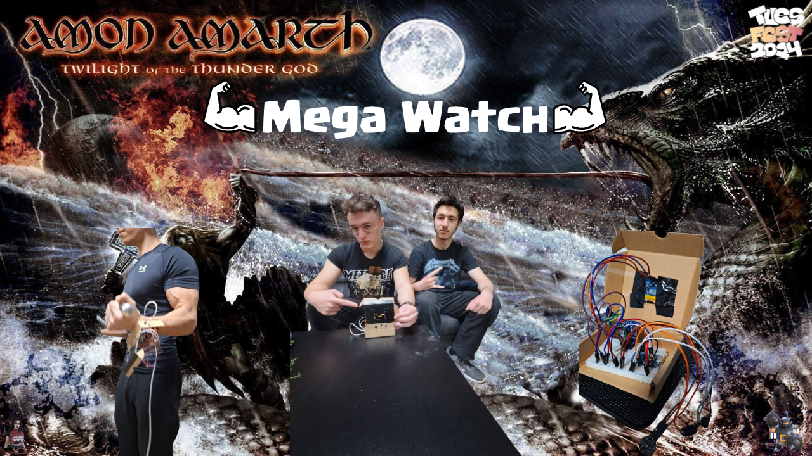

# Mega Watch

Mega Watch е смарт часовник, с вграден фитнес тракер. Този проект е изготвен за TuesFest 2024.

## Функционалности

- Показване на точна дата и час
- Фитнес тракер(Rep Counter) - Измерва повторения на дадено упражнение. След като сме измерили желаното количество имаме опция да нулираме повторенията и да започнем отначало.
- Педометър - Мери и показва крачки, като отново има опции за нулиране на броя крачки
- Сензор за пулс - Измерва и показва пулс

## Използвани Технологии

## Създатели
- Никола Кръстанов, 11г клас
- Георги Стоянов, 11г клас
